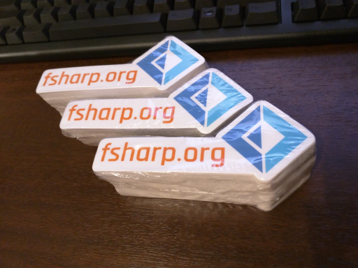

# fsharp.orgステッカー配布中です

この記事は [F# Advent Calendar 2015](http://connpass.com/event/22056/) の15日目の記事です。
14日目は [@gab_km](https://twitter.com/gab_km) さんの
「[Paketコトハジメ](http://gab-km.bitbucket.org/blog/html/2015/12/14/getting_started_paket.html)」でした。

ご覧の通り、残念ながらこの記事にはF#のコードは一切出てきません。単なる業務連絡です。

というわけで早速本題。

僭越ながら私は [F# Software Foundation](http://foundation.fsharp.org/) (FSSF)の公式な設立以来、
Board of Trustees(委員会役員的なものです)の一員として活動に参加させていただいております。
その活動の一貫として、今年に作成したfsharp.orgのステッカーを希望者に無料配布中です。

去年も作成していたみたいなんですが、どうも数が少なかったのか、もらい損ねたのか、
僕も今年初めて入手しました。

関東近郊の方であれば近々開催される(はずの)F#談話室にご参加いただくのが一番簡単な入手方法かと思いますが、
遠方の方あるいはすぐ欲しい、今すぐ寄越せという熱心な方には郵送しますので、
twitterのダイレクトメッセージないしは yukitos@gmail.com 宛に送り先を連絡ください。

もう1点、ステッカーの配布対象は日本国内に限りませんので、
中国、インド、etcのF#コミュニティリーダーをご存じの方で、
ステッカー欲しい、配布したいというリクエストがあれば
是非自分の方まで連絡をもらえるようつないでいただけると助かります。

----

まだ公式の議事録が上がっていないのであんまり大声では言えないんですが、
最近のFSSFではF# Working Groupが議題に上っています。
来年中には発足になるので、あの人たちやあの人たちを日本に招致して
イベント出来るといいなとひっそり目論んでいたりします。
